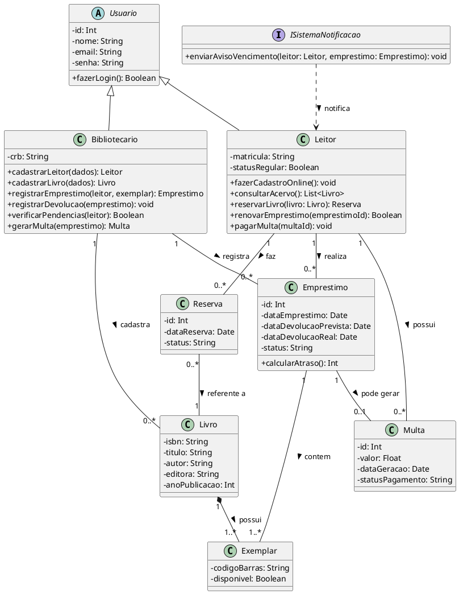

### Biblioteca

Para a biblioteca, Leitor e Bibliotecario também herdam de um usuário base. Criei a distinção entre Livro (o catálogo geral) e Exemplar (a cópia física que é efetivamente emprestada). O Sistema de Notificação também virou uma interface.

### Codigo PlantUML

### Imagem

