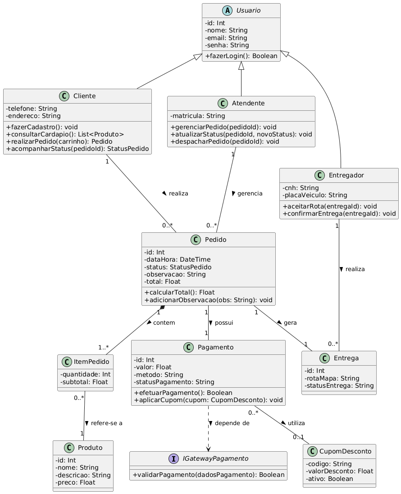

### Pizzaria Delivery 

Para a pizzaria, criei uma estrutura onde Cliente, Atendente e Entregador herdam de uma classe base Usuario, o Pedido é a classe central que se relaciona com ItemPedido, Pagamento e Entrega, o Gateway de Pagamento foi modelado como uma interface externa, e dentro do Cliente ele recebe uma "List" de produtos pois dentro de um pedido, pode se ter, diversos produtos.

### Codigo PlantUML

´´´plantuml
@startuml
skinparam classAttributeIconSize 0

' --- Interfaces Externas ---
interface IGatewayPagamento {
    + validarPagamento(dadosPagamento): Boolean
}

abstract class Usuario {
    - id: Int
    - nome: String
    - email: String
    - senha: String
    + fazerLogin(): Boolean
}

class Cliente {
    - telefone: String
    - endereco: String
    + fazerCadastro(): void
    + consultarCardapio(): List<Produto>
    + realizarPedido(carrinho): Pedido
    + acompanharStatus(pedidoId): StatusPedido
}

class Atendente {
    - matricula: String
    + gerenciarPedido(pedidoId): void
    + atualizarStatus(pedidoId, novoStatus): void
    + despacharPedido(pedidoId): void
}

class Entregador {
    - cnh: String
    - placaVeiculo: String
    + aceitarRota(entregaId): void
    + confirmarEntrega(entregaId): void
}

Usuario <|-- Cliente
Usuario <|-- Atendente
Usuario <|-- Entregador

' --- Entidades de Negócio ---
class Produto {
    - id: Int
    - nome: String
    - descricao: String
    - preco: Float
}

class Pedido {
    - id: Int
    - dataHora: DateTime
    - status: StatusPedido
    - observacao: String
    - total: Float
    + calcularTotal(): Float
    + adicionarObservacao(obs: String): void
}

class ItemPedido {
    - quantidade: Int
    - subtotal: Float
}

class Pagamento {
    - id: Int
    - valor: Float
    - metodo: String
    - statusPagamento: String
    + efetuarPagamento(): Boolean
    + aplicarCupom(cupom: CupomDesconto): void
}

class CupomDesconto {
    - codigo: String
    - valorDesconto: Float
    - ativo: Boolean
}

class Entrega {
    - id: Int
    - rotaMapa: String
    - statusEntrega: String
}

' --- Relacionamentos ---
Cliente "1" -- "0..*" Pedido : realiza >
Pedido "1" *-- "1..*" ItemPedido : contem >
ItemPedido "0..*" -- "1" Produto : refere-se a >

Pedido "1" -- "1" Pagamento : possui >
Pagamento "0..*" -- "0..1" CupomDesconto : utiliza >
Pagamento ..> IGatewayPagamento : depende de >

Pedido "1" -- "1" Entrega : gera >
Atendente "1" -- "0..*" Pedido : gerencia >
Entregador "1" -- "0..*" Entrega : realiza >

@enduml
´´´

### Imagem 
