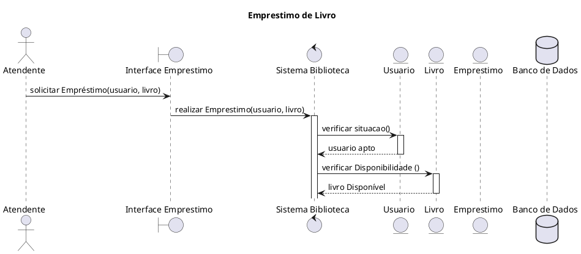

### `Biblioteca`

### `Codigo PlantUML`

```plantuml
@startuml
title Emprestimo de Livro
actor Atendente as atendente
boundary "Interface Emprestimo" as interface
control "Sistema Biblioteca" as bib
entity Usuario as usuario
entity Livro as livro
entity Emprestimo as emprestimo
database "Banco de Dados" as bd
'O atendente solicita o emprestimo de um livro
atendente -> interface : solicitar Empréstimo(usuario, livro)
'A interface chama a função realizar emprestimo
interface -> bib : realizar Emprestimo(usuario, livro)
activate bib
'O sistema de biblioteca verifica a situação do usuario
bib -> usuario : verificar situacao()
activate usuario
'Verifica que o usuario está apto para emprestimo
usuario --> bib : usuario apto
deactivate usuario
'verificar disponibilidade do livro
bib -> livro : verificar Disponibilidade ()
activate livro
'livro está disponível
livro --> bib : livro Disponível
deactivate livro
@enduml
```
### `Imagem`

`

`

