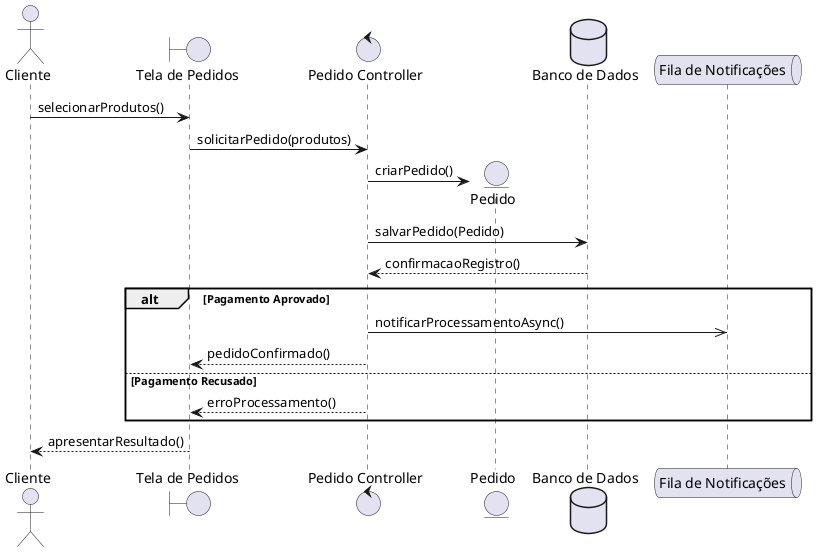
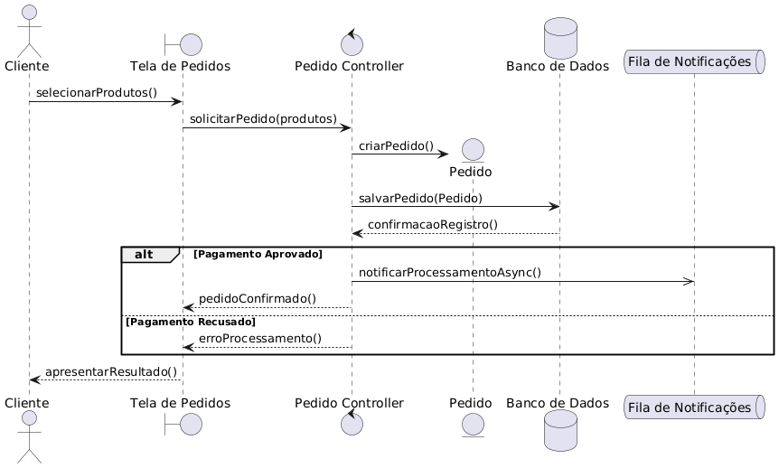
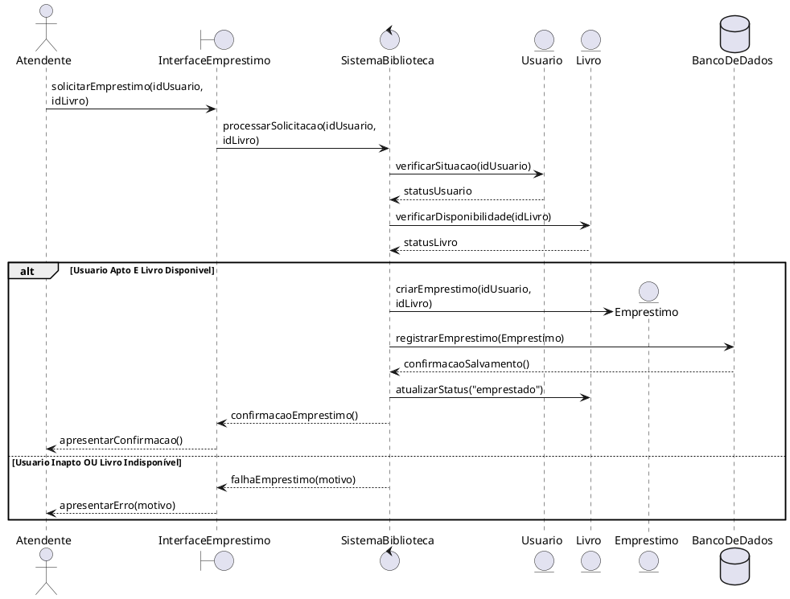
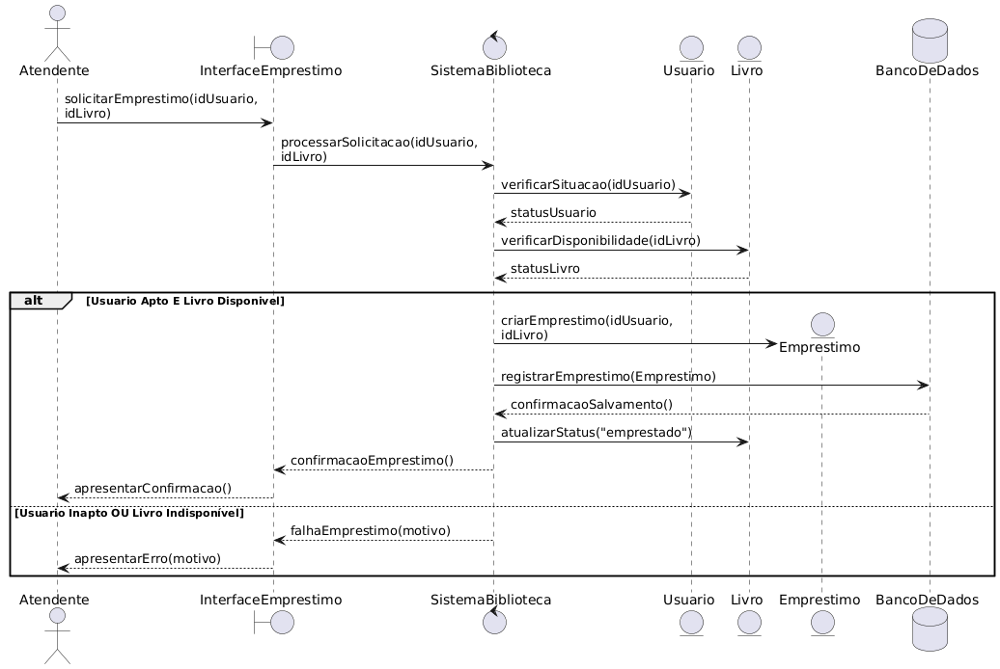

## Realização de Pedido

Para o processo de realização de pedido, estruturei a comunicação entre o ator (Cliente) e os componentes do sistema. A Tela de Pedidos atua como interface, encaminhando a ação para o Pedido Controller, que orquestra a criação da entidade e a persistência no Banco de Dados. O diagrama utiliza um bloco alt para tratar a condição do pagamento (aprovado ou recusado) e representa a comunicação assíncrona com a Fila de Notificações utilizando uma seta apropriada.

### Codigo PlantUML

### Imagem:

## Empréstimo de livro

Para o sistema de biblioteca estruturado em MVC, o Atendente interage com a InterfaceEmprestimo (View), que delega a lógica de negócio para o SistemaBiblioteca (Controller). O controlador realiza as verificações necessárias instanciando as classes de modelo (Usuario e Livro). Caso as regras de negócio sejam satisfeitas no bloco alt, a entidade Emprestimo é gerada, salva no BancoDeDados, o status do livro é alterado, e o sucesso é retornado à view. Caso contrário, o fluxo alternativo exibe a falha.

### Codigo PlantUML

### Imagem

