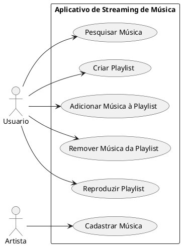
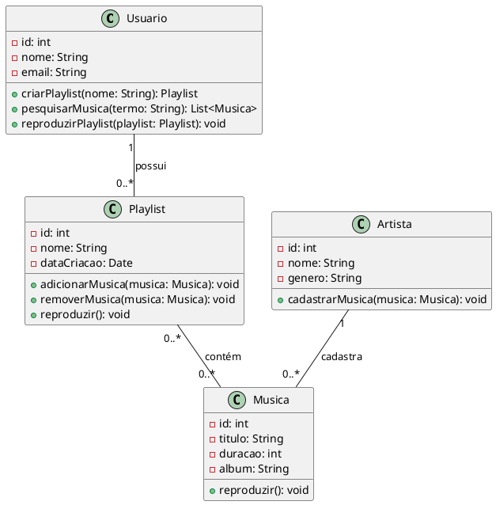
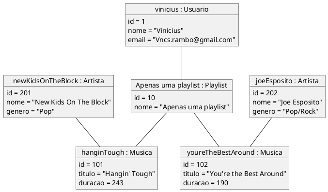
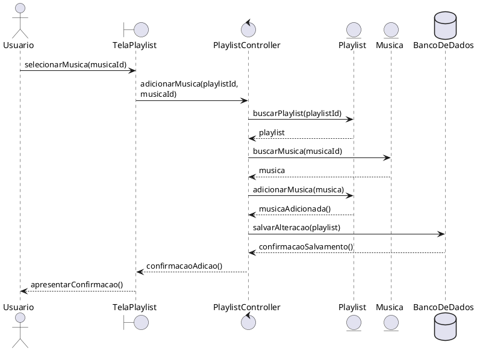

```plantuml
@startuml

object "usuario : Usuario" as usuario
object "tela : TelaPlaylist" as tela
object "controller : PlaylistController" as controller
object "playlist1 : Playlist" as playlist1
object "musica1 : Musica" as musica1
object "bd : BancoDeDados" as bd

usuario -> tela : 1: selecionarMusica(musicaId)
tela -> controller : 2: adicionarMusica(playlistId, musicaId)

controller -> playlist1 : 3: buscarPlaylist(playlistId)
playlist1 --> controller : 3.1: retornarPlaylist()

controller -> musica1 : 4: buscarMusica(musicaId)
musica1 --> controller : 4.1: retornarMusica()

controller -> playlist1 : 5: adicionarMusica(musica1)
playlist1 --> controller : 5.1: musicaAdicionada()

controller -> bd : 6: salvarAlteracao(playlist1)
bd --> controller : 6.1: confirmacaoSalvamento()

controller --> tela : 7: confirmacaoAdicao()
tela --> usuario : 8: apresentarConfirmacao()

@enduml
```

# Exercício: Aplicativo de Playlist

## 1. Diagrama de Casos de Uso

Para o sistema de streaming de música, o **Usuário** interage com as funcionalidades relacionadas à pesquisa, organização e reprodução de músicas. Já o **Artista** é responsável pelo cadastro de novas músicas no sistema. As funcionalidades de gerenciamento de playlists ficam associadas ao Usuário, permitindo criar uma playlist, adicionar ou remover músicas e reproduzir seu conteúdo.

### Codigo PlantUML

![[01.png]]

---

## 2. Diagrama de Classes

O diagrama de classes representa as principais entidades do aplicativo. Um **Usuário** pode possuir várias playlists, enquanto cada **Playlist** pertence a um único usuário. Uma playlist pode conter várias músicas e uma mesma música pode estar presente em várias playlists, caracterizando um relacionamento muitos-para-muitos. Cada **Música** está associada a um único **Artista**, enquanto um artista pode cadastrar várias músicas.

### Codigo PlantUML

![[02.png]]

---

## 3. Diagrama de Objetos

O diagrama de objetos apresenta um exemplo concreto do sistema em determinado momento. Neste cenário, o usuário **vinicius : Usuario** possui a playlist **Apenas uma playlist : Playlist**, que contém as músicas **"Hangin' Tough"**, da banda New Kids On The Block, e **"You're the Best Around"**, do artista Joe Esposito. Cada música está associada ao seu respectivo artista.

### Codigo PlantUML

![[03.png]]

---

## 4. Diagrama de Sequência

Para o cenário de **Adicionar Música à Playlist**, o Usuário seleciona uma música pela interface da playlist. A `TelaPlaylist` encaminha a solicitação ao `PlaylistController`, que localiza a playlist e a música e solicita à playlist que realize a associação. Após a operação, o controlador solicita ao Banco de Dados que persista a alteração e retorna a confirmação para a interface.

### Codigo PlantUML

![[04.png]]

---

## 5. Diagrama de Comunicação

O diagrama de comunicação representa o mesmo cenário de adição de uma música à playlist, porém destaca a colaboração entre os objetos envolvidos. As mensagens são numeradas para indicar a ordem em que as operações acontecem, desde a seleção da música pelo usuário até a confirmação da alteração.

### Codigo PlantUML

![[05.png]]
